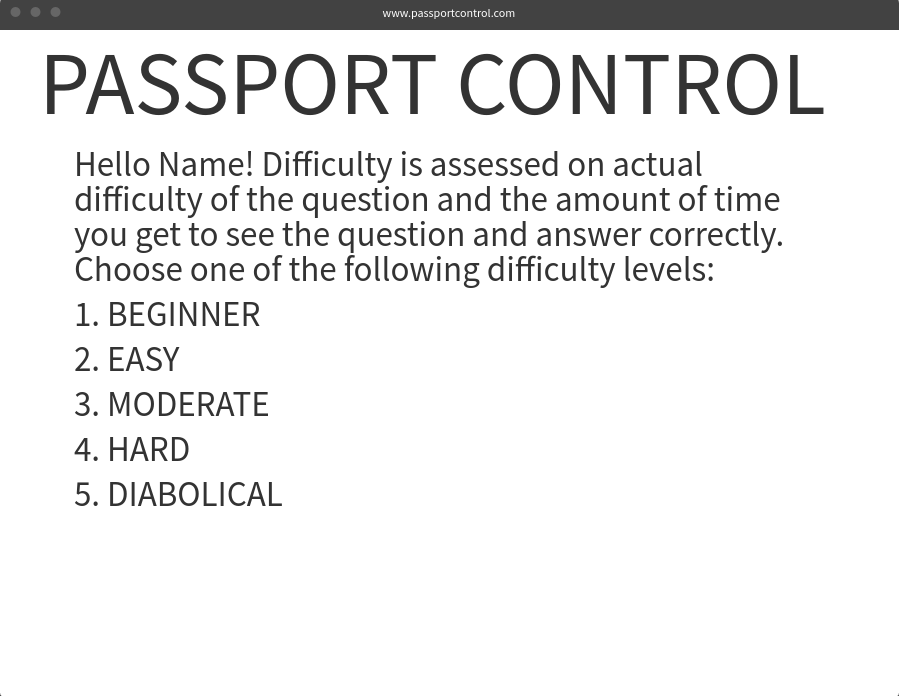

# Passport Control

Brian Martinez / February 3, 2018 

## Passport Control Proposal  

The name of the game I am choosing to make is called Passport Control. The premise of this game you will enter US immigration passport control. Upon entering you realise you don't have your passport. The customs agent offers you a deal, if you can answer six out of the 10 questions correctly he will let you in the country. Or else you are detained until further notice. 

I am choosing to make this game because both my parents received their citizenships in the early 2000's. I recalled how hard they studied and also I thought I would probably not get a good score if I was to take the citizenship test. I am also a diehard jeopardy fan so I thought why not take two things I’m passionate about and combine them in a fun game that could also end up being educational.

## Wireframe   

## Initial thoughts on game structure 

1. I want the player to initially be shown a landing page containing:
Passport control is a trivia game based on a selection from the civics(history and government) questions for the naturalization process test. Player must answer 6 out of 10 questions in order to beat the game. Remember if you get a wrong answer to use it as a learning experience and have fun!

All questions will be multiple choice questions, where the player must choose the WRONG option. Meaning the player will be shown a question such as:

Which of the following is NOT a day in the week?
1.Friday
2.Saturday
3.Briday				IS THE CORRECT ANSWER.
4.Thursday

2. Player then gets to choose difficulty level:
Difficulty is assessed on actual difficulty of the question and the amount of time you (the player) get to see the question and answer correctly. Choose one of the following difficulty levels:

1. BEGINNER
2. EASY
3. MODERATE
4. HARD
5. DIABOLICAL

3. Game Begins…

4. Possible later idea I have implementing the option for the player to choose if they get a question wrong, to get a pop box containing some info on the correct answers.

## Phases of Completion
Friday = pseudocode - initial code

Weekend = Tackle functions

Monday = tackle pictures

Tuesday = Polish

## Links and Resources  
